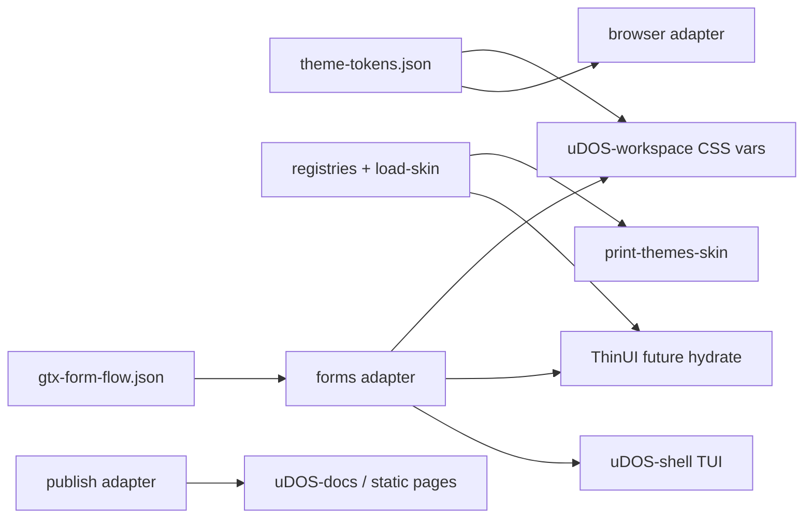

# Integration plan: ThinUI, workflow, Tailwind Prose, GTX forms

Cross-repo wiring for Workspace 06 exit criteria: one coherent story from tokens to operator surfaces.

## Current state (2026-04-01)

| Lane | Location | Status |
| --- | --- | --- |
| **ThinUI runtime** | `uDOS-thinui` `default-theme-resolver.ts` | Owns takeover frames; **does not** yet read `uDOS-themes` registries at runtime. |
| **ThinUI ↔ themes** | `uDOS-thinui/docs/themes-sibling-bridge.md`, `scripts/print-themes-skin.mjs` | Documented boundary + diagnostic. |
| **Themes adapters** | `uDOS-themes/src/adapters/*` | Node `.mjs` implementations + smoke; ThinUI TS adapters under `src/adapters/thinui/`. |
| **Workflow** | `workflow-default` adapter | Text board prototype; Wizard/binder can mirror step ids from GTX JSON in future. |
| **Tailwind Prose** | `publish-tailwind-prose` adapter | Emits `prose` class strings + HTML; **not** yet a shared npm/tailwind preset in workspace. |
| **GTX forms** | `examples/gtx-form-flow.json` + `forms` adapter | Canonical step flow + multi-surface renderers. |
| **Workspace web** | `browserDefaultShell.ts` + `theme-tokens.json` | CSS vars from JSON; sync script from themes repo. |

## Target architecture

## Integration steps (prioritised)

1. **ThinUI (phase C):** Optional import path: resolve `skin_id` → `loadSkinBundle` output → map `overrides.loader` to existing loader ids in resolver. No change to view loop ownership.
2. **Tailwind Prose:** Extract `proseClasses` / section markup contract from `browser` + `publish` adapters into a **documented class list**; add optional Tailwind preset package or workspace `tailwind.config` extension in a later repo PR (out of band if build tool not present).
3. **Workflow:** When Wizard exposes compile/publish steps, align task labels with GTX `steps[].id` for traceability.
4. **GTX in Shell:** Optional Node/TS wrapper that reads the same JSON and prints `renderTuiFormStep` output for CLI demos (reuse `uDOS-themes` as devDependency or sibling exec).

## Contracts not duplicated

- **GUI ownership:** `uDOS-dev/docs/gui-system-family-contract.md`
- **Display modes:** `docs/display-modes.md`

## Related

- `docs/step-form-presentation-rules.md`
- `docs/adapter-skin-registry-plan.md`
- `uDOS-workspace/apps/web/src/lib/theme/README.md`
